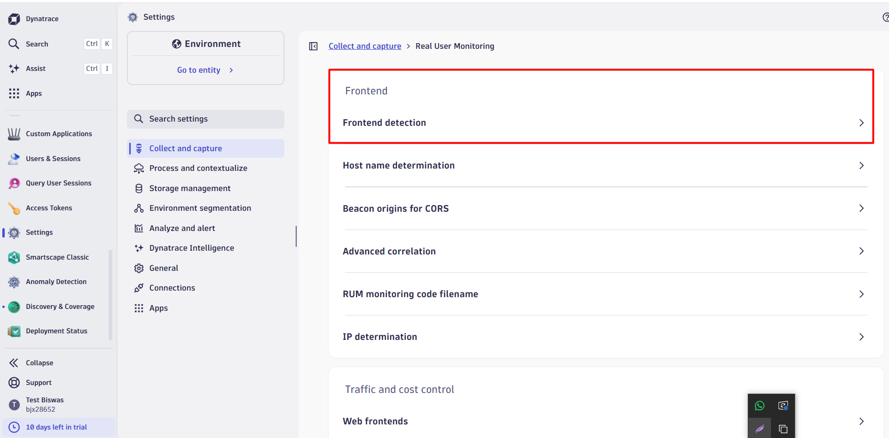

## RUM, APM, Management Zone, Tag, Anomaly Detection, metric events

- Email : gaper88465@soppat.com

---

# APM

- APM Stand for Application Platform Monitoring/Management
- APM is about automatically monitoring your applications end-to-end -from user interaction -> backend api call (backend Services) -> To the database .
- When a user clicks a button, what exactly happens across my system—and where does it slow down or fail?
  - Apdex rating (Application Performance Index) in a URL—especially , a score that tells you how satisfied users are with the performance of that specific URL (endpoint/page).



---

## Auto Injection Model

- If the injection model is not installed by default then we can add it manual
- Go to Infrastructure & Operations -> hosts settings -> Collect and Capture

---

## RUM

- To enable the real user monitoring got to
  - setting -> Collect and capture -> User Tag classic

- Rage Click

---

sudo nano /etc/nginx/conf.d/default.conf

```
server {
    listen 80;
    server_name _;

    location / {
        proxy_pass http://localhost:3000;

        proxy_http_version 1.1;
        proxy_set_header Upgrade $http_upgrade;
        proxy_set_header Connection "upgrade";
        proxy_set_header Host $host;
        proxy_cache_bypass $http_upgrade;
    }
}
```

---

## Alert Profile

-> Need to revise Again

- Severity:
  1.  Resources
  2.  Monitoring Unavailable
  3.  Availability
  4.  Error
  5.  Custom
  6.  Slow Down
